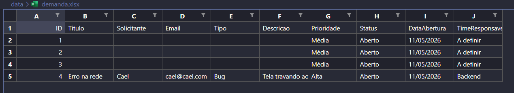

# Status do Projeto – Backend

## Última atualização
**Data:** 11/05/2026  
**Hora:** 14:23  

---

## ✅ O que foi feito (Backend)

Até o momento, foram implementadas as seguintes funcionalidades:

- ✅ Criar demanda
- ✅ Listar demandas
- ✅ Salvar demandas em arquivo Excel

---

## Detalhes da Implementação

### Criar Demanda
A criação da demanda está sendo feita via **POST** no **Postman**, utilizando o **body** da requisição.

**Exemplo de body (JSON):**

```json
{
  "titulo": "Erro na rede",
  "solicitante": "Cael",
  "email": "cael@cael.com",
  "tipo": "Bug",
  "descricao": "Tela travando ao salvar",
  "prioridade": "Alta",
  "time": "Backend"
}
``` 

### Salvamento no Excel
Após a criação, a demanda é salva automaticamente em um arquivo Excel, conforme o exemplo abaixo: 

